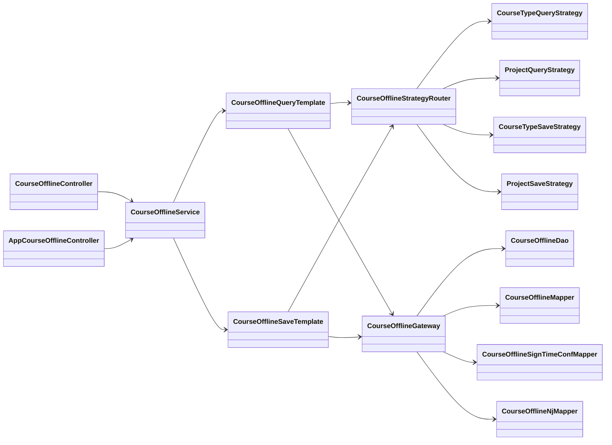
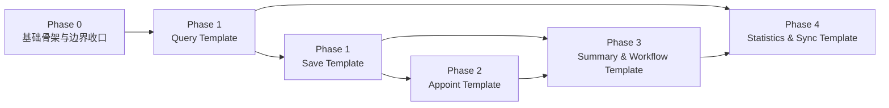

# Course Offline 活动域重构总览 Spec

## 1. 目标

本次重构聚焦当前分支 `course_offline` 活动域，范围覆盖：

- `CourseOfflineService`
- `CourseOfflineAppointService`
- `ActivityWorkflowServiceImpl`

目标不是推翻现有 `controller -> service -> mapper/xml` 三层认知，而是在完全兼容现有接口、现有表结构、现有 XML 的前提下，把活动域从“大 service 模式”重构为“兼容入口 + 模板骨架 + 策略扩展 + 网关收口”的可维护结构。

## 2. 全局强制约束

1. controller 层接口路径、入参、出参、分页模型、导出模型必须保持兼容。
2. 所有阶段实现前必须重新扫描代码，重新判断 spec 是否仍然准确；如果代码现实已变化，应以阶段核心目标为优先，调整落地细节，但不能破坏本总览约束。
3. 所有新增或重构的方法必须补一句话 JavaDoc；方法内部应增加适量行级注释，标明兼容入口、模板步骤、策略分发、权限注入、后置副作用等关键点。
4. 兼容入口层不允许重新长成大方法。
5. 模板层不允许直接写项目名 if/else。
6. 策略层不允许直接面向 controller DTO、AjaxResult、TableDataInfo、XML 细节。
7. 网关层不承载业务规则，只负责语义化包装现有 `mapper/dao/xml` 调用。

## 3. 回归式重构原则

### 要做什么

- 保留现有 `CourseOfflineService`、`CourseOfflineAppointService`、`ActivityWorkflowServiceImpl` 作为官方入口。
- 在 `service/courseoffline/` 下新增 `template/`、`strategy/`、`gateway/`、`support/` 四类子目录。
- Query 链路采用“轻模板 + `@DataScope` 兼容入口 + 语义查询网关”。
- Save 链路采用“完整模板 + 课型/项目策略 + 语义保存网关”。
- 第二阶段以后逐步把 appoint、summary、workflow、statistics 迁入各自模板。

### 不要做什么

- 不要新建一套脱离当前项目认知的 `application/model/executor/result` 重层结构。
- 不要重写 Ruoyi 权限模型，也不要把 `@DataScope` 迁入策略或网关。
- 不要一开始就做跨活动/培训/体检的超级通用框架。
- 不要为了抽象而大面积修改 XML 参数类型和继承体系。

## 4. 第一阶段目标边界

第一阶段只正式落地：

- Query 主读模型链路
- Save 主写模型链路

第一阶段暂不下刀：

- appoint 主流程
- summary 主流程
- workflow 主流程
- statistics/export/sync 主流程

## 5. 包结构

```text
service/courseoffline/
├── CourseOfflineService.java
├── CourseOfflineAppointService.java
├── ActivityWorkflowService.java
├── ActivityWorkflowServiceImpl.java
├── template/
│   ├── CourseOfflineQueryTemplate.java
│   └── CourseOfflineSaveTemplate.java
├── strategy/
│   ├── coursetype/
│   ├── project/
│   └── CourseOfflineStrategyRouter.java
├── gateway/
│   └── CourseOfflineGateway.java
└── support/
    ├── CourseOfflineQueryContext.java
    ├── CourseOfflineSaveContext.java
    ├── CourseOfflineOperatorContext.java
    ├── CourseOfflineQueryScene.java
    └── CourseOfflineSaveScene.java
```

## 6. 类关系图



## 7. 迁移顺序图



## 8. `@DataScope` 兼容原则

### 要做什么

- `@DataScope` 的核心锚点定义为：Spring 代理可切入的公开方法 + 首参可承接 `params.dataScope`。
- `@DataScope` 可以从 `CourseOfflineService` 部分迁到 `CourseOfflineQueryTemplate` 的公开方法。
- 现有已经继承 `BaseEntity` 的查询 VO/DTO 优先复用。
- 只有当首参不满足注入条件时，才新增最小查询载体。

### 不要做什么

- 不要机械要求 `@DataScope` 必须留在 `CourseOfflineService`。
- 不要让模板内部自调用触发 `@DataScope`。
- 不要让策略或网关承担权限 SQL 注入职责。

## 9. 阶段文档依赖

- Query 设计细节：见 [01-query-template-spec.md](./01-query-template-spec.md)
- Save 设计细节：见 [02-save-template-spec.md](./02-save-template-spec.md)
- Appoint 设计细节：见 [03-appoint-template-spec.md](./03-appoint-template-spec.md)
- Summary/Workflow 设计细节：见 [04-summary-workflow-spec.md](./04-summary-workflow-spec.md)
- Statistics/Sync 设计细节：见 [05-statistics-sync-spec.md](./05-statistics-sync-spec.md)

## 10. 验收总原则

1. `CourseOfflineService` 中已迁移方法必须明显瘦身，保留兼容入口职责。
2. 已迁移链路不再接受新需求直接堆回旧实现。
3. 每完成一个阶段，必须做 controller 侧入参与出参回归校验。
4. 每完成一个阶段，必须做关键 XML 权限注入回归校验，确认 `${xxx.params.dataScope}` 仍按预期工作。
