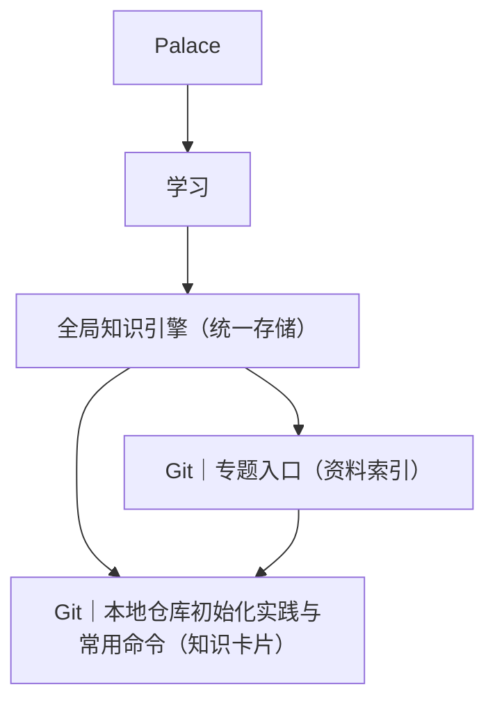

# Git Notion 知识沉淀设计

## 1. 背景

本次需求不是单纯记录一段对话，而是把一次真实发生的 Git 本地仓库初始化实践，沉淀为符合现有 Notion 知识体系的可检索知识资产。

当前已确认的用户要求：

- 必须符合 `Palace -> 学习 -> 全局知识引擎` 的知识体系架构
- 内容必须结构化、易读，不能只是纯文本堆砌
- 内容要偏日常实用、便于记忆，不做“大而全”的 Git 教科书
- 最终结构采用“Git 专题入口 + 子知识点目录”模式
- “本地仓库初始化实践”需要作为高质量知识卡片被专题入口引用

## 2. 目标与非目标

### 2.1 目标

本次沉淀只产出 2 条 Notion 知识记录：

1. `Git｜专题入口`
2. `Git｜本地仓库初始化实践与常用命令`

这 2 条记录都进入 `全局知识引擎`，并通过专题页目录建立导航关系。

### 2.2 非目标

以下内容明确不纳入本次范围：

- 远程仓库相关内容，如 `git remote`、`push`、`pull`
- 多人协作流程，如 `rebase`、`cherry-pick`、`PR`
- 进阶底层原理，如对象模型、refs、packfile
- 超出本次场景的命令百科式汇总

## 3. 现有 Notion 上下文

### 3.1 页面与数据库

| 对象 | 类型 | 说明 |
| --- | --- | --- |
| `Palace` | 页面 | 顶层知识入口 |
| `学习` | 页面 | 学习分支入口，本身不直接存知识正文 |
| `全局知识引擎` | 数据库 | 统一知识存储位置 |

### 3.2 关键 ID

| 名称 | 值 |
| --- | --- |
| `Palace` 页面 ID | `32f0c9cd-20f4-8157-9392-e83a1be7fdd5` |
| `学习` 页面 ID | `32f0c9cd-20f4-81b3-b2ad-e85ce2bb673b` |
| `全局知识引擎` 数据源 | `collection://f140e35b-c54b-44df-93d8-f7d76b8bac5a` |
| `通用｜知识卡片` 模板 ID | `3300c9cd-20f4-800f-b22b-de82f2395842` |
| `通用｜资料索引` 模板 ID | `3300c9cd-20f4-8033-9d2f-f65eadb475d9` |

### 3.3 数据库字段约束

本次会用到的字段如下：

| 字段 | 值 |
| --- | --- |
| `领域` | `学习` |
| `标签` | `Git` |
| `来源类型` | `自写` 或 `对话` |
| `内容类型` | `资料索引` 或 `知识卡片` |
| `阶段` | `已输出` |

## 4. 信息架构设计

本次采用“检索优先”的双记录结构，而不在 `学习` 页面下直接创建普通子页面。



### 4.1 设计理由

- `学习` 分支本身是入口视图，不适合单独长出一套页面树
- `全局知识引擎` 已经承担统一检索、分类、筛选职责
- “专题入口 + 知识卡片”的组合既保留阅读路径，也保留数据库检索能力
- 未来如果继续补充 `Git` 相关内容，只需要继续往 `专题入口` 中追加目录链接

## 5. 内容设计原则

### 5.1 结构化优先

每页正文都优先采用以下构件组合：

- 结论型标题
- `callout` 提示区
- 代码块
- 速查表
- 简短步骤列表
- 低复杂度流程图或其等价替代

### 5.2 记忆优先

正文不追求覆盖全部 Git 知识，而强调：

- 高频命令优先
- 场景优先于概念
- “什么时候用”优先于“定义是什么”
- 3 到 5 个易踩坑提醒
- 口诀或记忆锚点

### 5.3 日常使用优先

知识卡片必须在 1 到 2 分钟内完成回查，用户应能快速获得：

- 正常初始化流程
- 遇到嵌套 `.git` 的处理思路
- 日常最小命令集
- 提交与回溯的基本动作

## 6. 记录一：Git｜专题入口

### 6.1 数据属性

| 字段 | 目标值 |
| --- | --- |
| `名称` | `Git｜专题入口` |
| `领域` | `学习` |
| `内容类型` | `资料索引` |
| `来源类型` | `自写` |
| `标签` | `Git` |
| `阶段` | `已输出` |

### 6.2 页面职责

该页面不是教程正文，而是 Git 学习专题的目录入口，负责：

- 说明本专题的边界
- 提供知识点导航
- 汇总高频速查内容
- 作为后续 Git 相关知识卡片的稳定入口

### 6.3 正文结构

建议正文结构如下：

1. `专题说明`
2. `你会在这里看到什么`
3. `知识点目录`
4. `Git 日常最小命令集`
5. `后续可扩展知识点`

### 6.4 内容草稿

```markdown
<callout icon="🧭" color="gray_bg">
这个专题只保留我日常最常用、最容易忘、最值得快速回查的 Git 知识，不做大而全整理。
</callout>

## 你会在这里看到什么
- 本地仓库初始化
- 日常提交与查看状态
- 常见回滚与撤销
- 后续再补分支基础

## 知识点目录
- `Git｜本地仓库初始化实践与常用命令`（在实践卡片创建完成后，将其真实页面链接回填到这里）

## Git 日常最小命令集
| 目的 | 命令 |
| --- | --- |
| 初始化仓库 | `git init` |
| 查看状态 | `git status` |
| 加入暂存区 | `git add -A` |
| 创建提交 | `git commit -m "..."` |
| 查看历史 | `git log --oneline` |
| 回到某次提交 | `git reset --hard <commit>` |

## 后续可扩展知识点
- Git｜日常提交流程
- Git｜撤销与回滚
- Git｜分支基础
```

### 6.5 呈现要求

- 首页内容控制在 1 屏到 2 屏之间
- 目录项必须可直接点击进入实践卡片
- 速查表必须只有日常高频命令，不扩成百科

## 7. 记录二：Git｜本地仓库初始化实践与常用命令

### 7.1 数据属性

| 字段 | 目标值 |
| --- | --- |
| `名称` | `Git｜本地仓库初始化实践与常用命令` |
| `领域` | `学习` |
| `内容类型` | `知识卡片` |
| `来源类型` | `对话` |
| `标签` | `Git` |
| `阶段` | `已输出` |

### 7.2 页面职责

该页面是面向日常回查的实践卡片，必须解决两个问题：

1. 正常情况下，本地 Git 仓库该如何初始化
2. 当目录里已经存在多个嵌套 `.git` 时，应如何正确处理

### 7.3 正文结构

建议正文结构如下：

1. `核心结论`
2. `场景背景`
3. `正常初始化流程`
4. `本次特殊问题：embedded git repository`
5. `命令速查表`
6. `可直接复用的命令块`
7. `避坑提醒`
8. `记忆锚点`

### 7.4 内容草稿

```markdown
<callout icon="✅" color="green_bg">
如果只是把本地目录当成版本管理容器，标准流程是：`git init` -> 写 `.gitignore` -> `git add .` -> `git commit`。
</callout>

## 场景背景
这次目标是把 `/Users/dalwin/Documents/AI` 作为本地 Git 仓库使用，只做版本回溯，不连接远程仓库。

执行 `git add .` 后出现了 `embedded git repository` 警告，原因是目录里已有多个子目录自带 `.git/`，外层仓库会把它们当成嵌套仓库而不是普通文件内容。

## 正常初始化流程
1. `git init`
2. 新建 `.gitignore`
3. `git add .`
4. `git commit -m "initial commit"`
5. `git status`

## 本次特殊问题：embedded git repository
处理思路不是硬提交，而是先处理子目录里的内部 `.git` 元数据，再重新暂存。

### 处理步骤
1. 找出哪些子目录带有 `.git`
2. 决定这些目录要不要继续保留独立仓库身份
3. 如果外层仓库要完整纳入它们，就先移走内部 `.git`
4. `git reset`
5. `git add .`
6. `git commit`

## 命令速查表
| 命令 | 用途 | 什么时候用 |
| --- | --- | --- |
| `git init` | 初始化仓库 | 第一次建立本地版本管理 |
| `git status` | 看工作区和暂存区状态 | 每次修改前后都可用 |
| `git add .` | 把当前目录改动加入暂存区 | 准备提交时 |
| `git reset` | 清空暂存区但保留文件改动 | 加错内容时 |
| `git commit -m "..."` | 创建一个版本快照 | 形成可回溯节点时 |
| `git log --oneline` | 查看简洁历史 | 找最近提交或回退点 |

## 可直接复用的命令块
```bash
git init
printf ".DS_Store\n**/.DS_Store\n" > .gitignore
git add .
git commit -m "initial commit"
git status
```

## 避坑提醒
- 看到 `embedded git repository` 时，不要直接忽略后提交
- 外层仓库如果要完整管理子目录内容，就不能保留子目录里的 `.git/`
- `git reset --hard <commit>` 会丢失未提交修改，使用前必须确认
- `.DS_Store` 这类系统垃圾文件应在一开始就忽略

## 记忆锚点
`先 init，后 ignore，再 add/commit；遇嵌套，先处理内部 .git。`
```

### 7.5 呈现要求

- 正文以“结论先行”为首屏
- 命令说明必须是“命令 + 用途 + 场景”三列
- 必须包含至少 1 个可直接复制执行的代码块
- 避坑提醒不超过 4 条，保持记忆负担可控

## 8. 导航与关联方式

### 8.1 导航规则

- `Git｜专题入口` 中的 `知识点目录` 链接到实践卡片
- 实践卡片正文结尾增加“返回 Git 专题入口”的链接

### 8.2 分类规则

- 两条记录都使用 `标签 = Git`
- 两条记录都使用 `领域 = 学习`
- `专题入口` 用 `资料索引`
- `实践卡片` 用 `知识卡片`

## 9. 实施约束

### 9.1 约束

- 不修改 `学习` 页面结构
- 不新建平行数据库
- 不扩展到远程仓库主题
- 不为了“看起来完整”而加入与本次场景无关的命令

### 9.2 风险

| 风险 | 影响 | 控制方式 |
| --- | --- | --- |
| 内容过长 | 降低回查效率 | 强制只保留本次场景与高频命令 |
| 总页空泛 | 无法承担专题入口职责 | 首页必须有目录和速查表 |
| 卡片偏教程化 | 记忆负担重 | 强制保留“核心结论”“避坑提醒”“记忆锚点” |

## 10. 验收标准

本次设计完成后，应满足以下标准：

1. `Git｜专题入口` 和 `Git｜本地仓库初始化实践与常用命令` 都存在于 `全局知识引擎`
2. 两条记录在 `学习` 相关视图下可被检索到
3. `Git｜专题入口` 中存在可点击的知识点目录
4. 实践卡片正文不是纯文本，而是包含 `callout`、代码块、速查表和清单结构
5. 实践卡片可以在 1 到 2 分钟内完成阅读回查
6. 内容边界聚焦本地 Git 初始化和日常回查，不扩写成完整 Git 教程

## 11. 计划前结论

该需求适合进入单一执行计划，不需要拆成多个独立子项目。后续计划只需要围绕以下动作展开：

1. 在 `全局知识引擎` 中创建 2 条记录
2. 按本 spec 填充正文
3. 建立目录链接
4. 做一次最终校验，确认在 `学习` 分支检索与阅读体验上都符合要求
