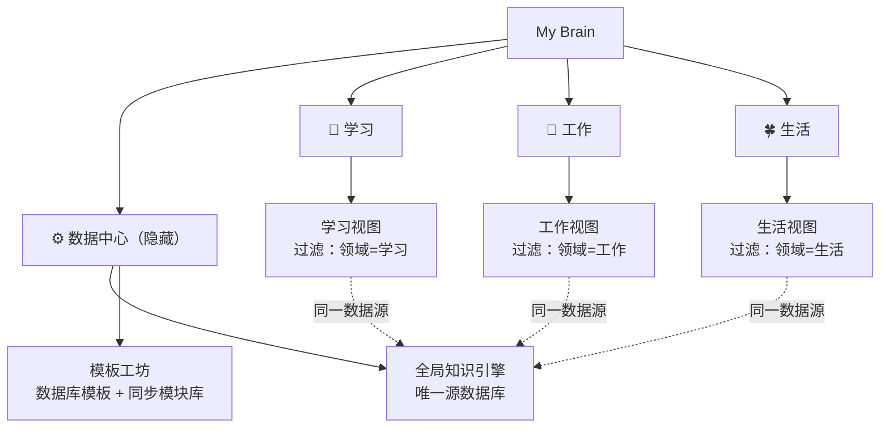
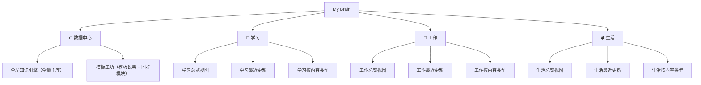

# 有意思的记录

## 知识库

### 架构

整体架构

```mermaid
graph TD
    A["My Brain"] --> B["⚙️ 数据中心（隐藏）"]
    A --> C["📘 学习"]
    A --> D["💼 工作"]
    A --> E["🍀 生活"]

    B --> F["全局知识引擎<br/>唯一源数据库"]
    B --> G["模板工坊<br/>数据库模板 + 同步模块库"]

    C --> H["学习视图<br/>过滤：领域=学习"]
    D --> I["工作视图<br/>过滤：领域=工作"]
    E --> J["生活视图<br/>过滤：领域=生活"]

    H -.同一数据源.-> F
    I -.同一数据源.-> F
    J -.同一数据源.-> F

```

细节

```mermaid
graph TD
    A["My Brain"] --> B["⚙️ 数据中心"]
    A --> C["📘 学习"]
    A --> D["💼 工作"]
    A --> E["🍀 生活"]

    B --> F["全局知识引擎（全量主库）"]
    B --> G["模板工坊（模板说明 + 同步模块）"]

    C --> H["学习总览视图"]
    C --> I["学习最近更新"]
    C --> J["学习按内容类型"]

    D --> K["工作总览视图"]
    D --> L["工作最近更新"]
    D --> M["工作按内容类型"]

    E --> N["生活总览视图"]
    E --> O["生活最近更新"]
    E --> P["生活按内容类型"]

```